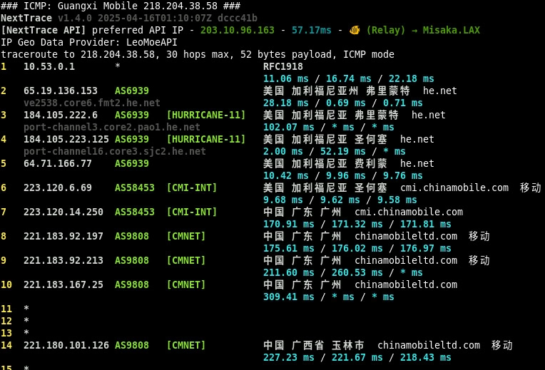
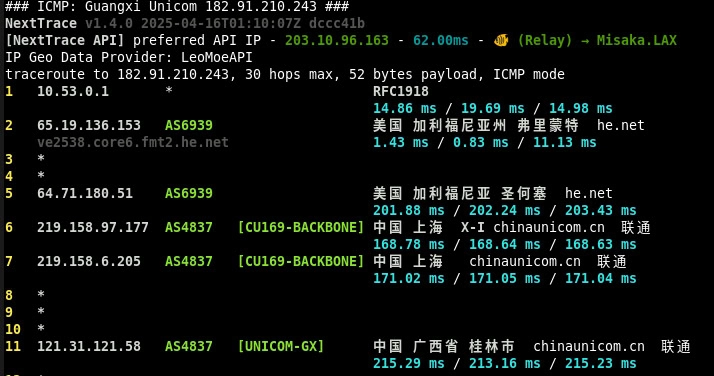
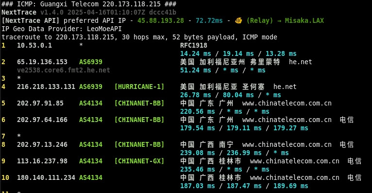

# 搬瓦工 MINICHICKEN：年付$19的稳定选择，适合什么场景？

如果你需要一台省心的VPS来跑机器人、小型API或个人博客，不追求极致的访问速度，那搬瓦工这款年付$19的MINICHICKEN套餐值得关注。1核/1GB内存/20GB硬盘/1TB月流量，配合免费快照和热备功能，在同价位中稳定性突出。但如果你的核心需求是翻墙或对大陆访问速度有较高要求，那这款机器并不适合——HE线路的回程速度确实是硬伤。

---

## 先说清楚：这台机器不适合谁

**千万别买的情况：**
- 想要搭梯子或解锁服务的
- 对中国大陆访问速度有明确要求的
- 只看便宜、对搬瓦工的稳定性和数据安全特性完全无感的（那不如直接选Racknerd或Cloudcone）

**真心建议入手的情况：**
- 需要跑稳定服务，比如Telegram机器人、API后端
- 托管对大陆速度无要求的小博客或外贸站点（套个Cloudflare CDN就行）
- 想要一台"年费一交、好几年不用操心"的省心机器
- 看重数据安全和商家可靠性，不想担心跑路或丢数据

---

## 优势与劣势：摆明了说

### 这台机器的短板

**HE线路拖后腿**  
三网回程全走HE线路，到中国大陆的速度基本垫底。去程虽有优化但意义不大，晚高峰丢包率还不低。想翻墙的直接Pass。

**不可切换机房**  
搬瓦工的机房切换功能在某些时候挺实用，但这款套餐锁死在Fremont机房，没得选。

**机房IP特性**  
搬瓦工所有IP都会被标记为机房IP，想用来解锁落地服务的就别指望了。

**性价比看场景**  
如果你完全用不上搬瓦工的热备、快照、IP管理、稳定性这些特性，单纯比价格，Racknerd和Cloudcone确实更便宜。

### 这台机器的亮点

**免费快照机制**  
3个临时快照（30天自动删除）+ 2个永久快照（永久保留），随时回滚数据。

**自动热备份**  
系统免费提供3-4个循环备份，不用担心数据丢失。

**IP信誉管理严格**  
搬瓦工对垃圾邮件和对外攻击监控严格，IP信誉在机房IP中算是相对较高的。如果你需要一台长期稳定的服务器，👉 [搬瓦工的IP管理机制能省不少心](https://bandwagonhost.com/aff.php?aff=79616)。

**稳定性有保障**  
从没出过丢数据的情况，极少无故宕机。除了机房停电这种不可抗力，长时间宕机的情况几乎见不到。

**人性化运维策略**  
DDoS进黑洞后15分钟自动恢复，CPU超资源限制时降主频而不是直接停机，这些细节体验比很多廉价商家强太多。

**资源隔离到位**  
很少因为DDoS或邻居滥用资源导致你的VPS变慢，这在共享主机环境里其实挺难得。

**可靠商家里价格偏低**  
在老牌可靠商家中，这个价位算是比较良心的。比如BuyVM的1GB内存套餐要$24/年。

---

## 线路实测：速度确实一般

三网回程全是HE线路，到国内的速度非常非常一般。下面是实际路由测试截图：

从路由追踪可以看出，三大运营商回程都要经过HE的骨干网，这就是速度上不去的根本原因。如果你的服务面向海外用户或对大陆速度要求不高，那问题不大；但如果主要用户在国内，这条线路确实会成为瓶颈。

---

## 值得升级吗？对比老款分析

如果你手里还有以前$18.99/年的老款套餐在用，认真考虑一下升级吧。迁移过程很简单，就一个快照直接搬过来的事。

**升级收益明显：**
- 内存翻倍：512MB → 1GB
- 流量几乎翻倍：550GB → 1000GB
- CPU性能更强
- 价格反而更便宜

**唯一的代价：**
- 不能切换机房
- 线路锁定为HE单线

对大多数跑服务的场景来说，内存和流量的提升带来的实际价值，远比机房切换功能重要。

---

## 总结：这台机器适合谁

如果你需要一台"续费后就不用管"的省心机器，用来跑一些对大陆速度要求不高的稳定服务，搬瓦工这款MINICHICKEN套餐在同价位中是稳定性最好的选择。免费快照、自动热备、严格的资源管理和IP信誉保障，这些特性在$19/年这个价位段几乎找不到第二家。但如果你的核心需求是速度或翻墙，那还是看看其他线路的套餐吧。想要了解更多稳定可靠的VPS方案，👉 [可以到搬瓦工官网看看其他配置](https://bandwagonhost.com/aff.php?aff=79616)。
